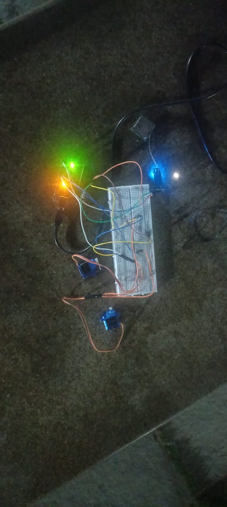
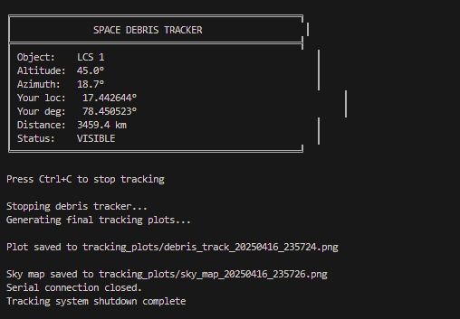
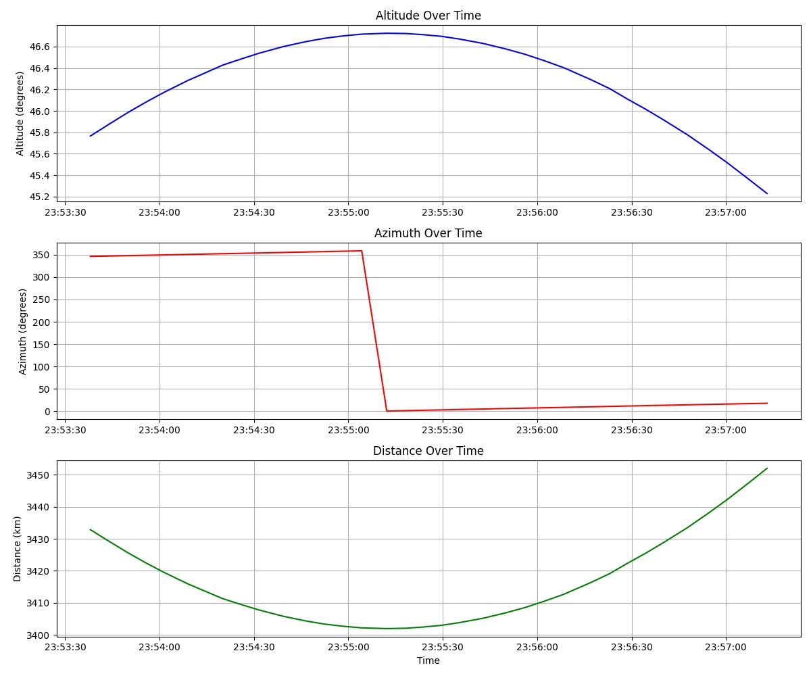
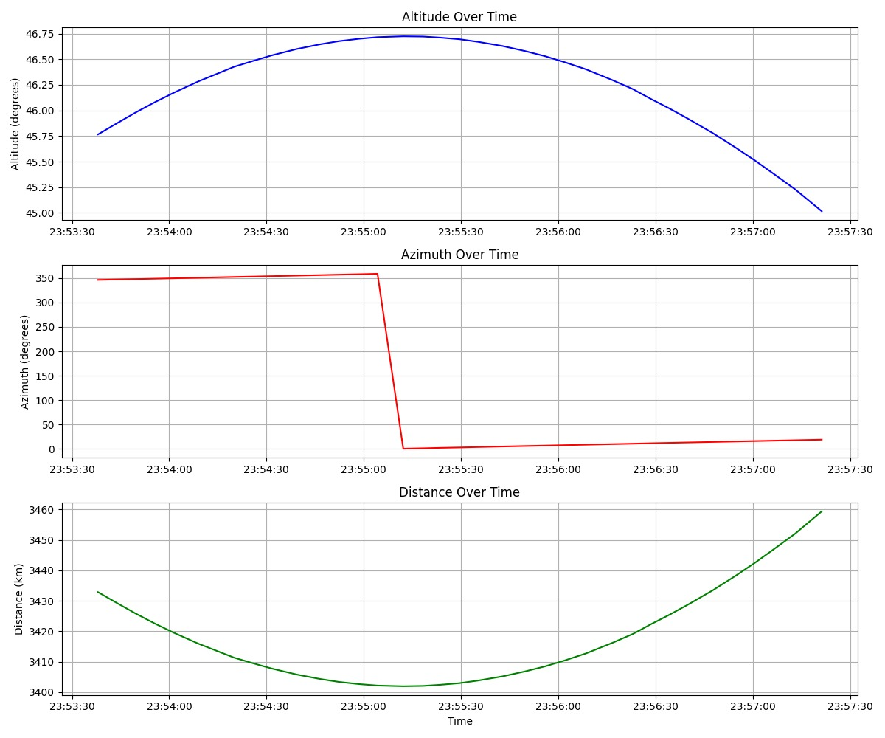
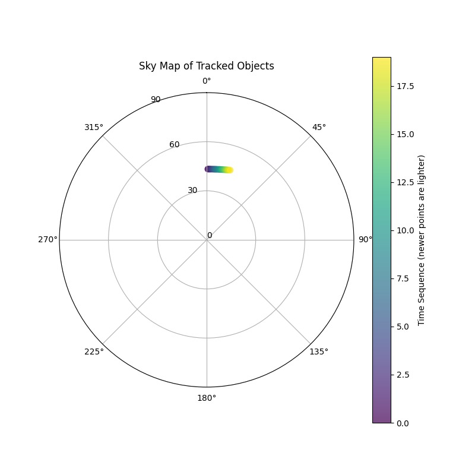
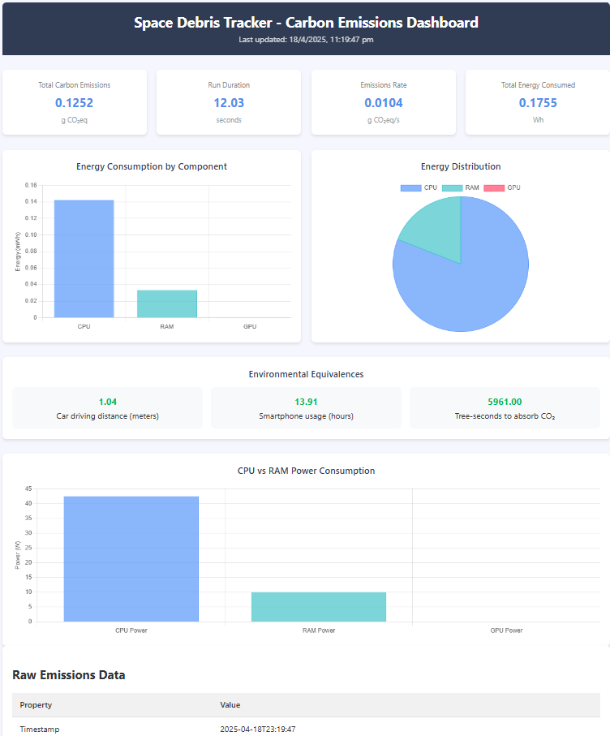
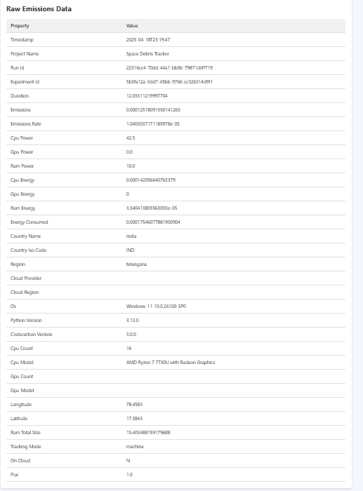

# Space Debris Tracker

## Introduction

This repository contains a Python script that tracks space debris using the TLE (Two-Line Element) format. The script fetches TLE data from CelesTrak, calculates the position of space debris, and visualizes it on a map using Folium.

## Requirements

- Python 3.x
- `requests` library for fetching TLE data
- `numpy` library for numerical calculations
- `skyfield` library for satellite tracking
- `matplotlib` library for plotting graphs
- `datetime` library for date and time manipulation
- `pyserial` library for serial communication
- `packaging` library for version handling

## Hardware Requirements

- Arduino Uno
- GPS Module (e.g., Neo-6M GPS Module)
- Servo Motor x2
- Jumper Wires
- Breadboard
- Uno to USB cable for connecting Arduino to the computer

## Hardware Connections

### Connect the GPS module to the Arduino Uno using the following connections

- GPS TX pin to Arduino Digital pin 4
- GPS RX pin to Arduino Digital pin 3
- GPS VCC pin to Arduino 5V
- GPS GND pin to Arduino GND
  
### Connect the servo motor to the Arduino Uno using the following connections

#### Servo motor 1 connection

- Servo motor signal(Orange/Yellow) pin to Arduino Digital pin 9
- Servo motor VCC(red) pin to Arduino 5V
- Servo motor GND(Brown/Black) pin to Arduino GND

#### Servo motor 2 connection

- Servo motor signal(Orange/Yellow) pin to Arduino Digital pin 10
- Servo motor VCC(red) pin to Arduino 5V
- Servo motor GND(Brown/Black) pin to Arduino GND

## Installation

- Clone the github repo
```git clone https://github.com/kareem1207/Space-Debris-Tracker.git```

- run following commands in the terminal to install the required libraries

```bash
cd Space-Debris-Tracker
pip install -r requirements.txt
python main.py
```

## Contributions

- Fork the project and follow the Installation steps.
- Contributions are open any contribution towards the progress of project is appreciated.

### Output and hardware setup images

#### Hardware Setup



### Output



### Graphical representation of the data





### Carbon foot print

This is the carbon footprint of the project. The values are calculated based on the energy consumption of the hardware and the carbon intensity of the electricity used.
We used CodeCarbon to calculate the carbon footprint of the project. The values are based on the energy consumption of the hardware and the carbon intensity of the electricity used.

You can open emissions_dashboard.html file to see the carbon footprint of the project.
You can also see the carbon footprint in the images below.

### Carbon Footprint Images



